<h1 align="center">Guess the Location</h1>

## Description 

This game is loosely based on the combination of the games, 'Guess the Word' and 'Hang Man'. But instead of words, the player has to guess the location. The location can be a city, a country or a popular place. The player are given a hint on what the location is and they have to fill in the empty field by clicking the letter buttons to input it to the board. The correct letter is put in the board and the selected letter button will be colored green, but incorrect letter result in a life being taken out and the letter button being colored red. 

The player are given five chances to put in the correct letter on the board to figure out the location. Once their five chances are up, the game is over and it will reveal the correct answer. 

The site is live can be access [here](https://krandon1986.github.io/project-2-js-guess-the-location)

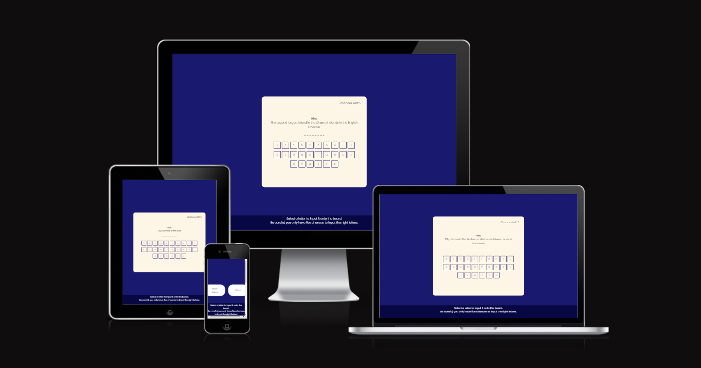

## Design 

- __Color Pallete__ 
    - The two main colors that are used MidnightBlue and OldLace.
    - MidnightBlue is used as the background color for the site. 
    - OldLace is used as the background color for the game board and its letter buttons on it. 

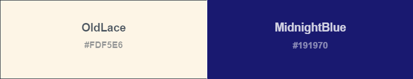

- __Typography__
    - Poppins google font will be used for throughout the site, and it will fall back to san serif if the web browser can't render Poppin font on the site. 

- __Wireframe__
    - The Main menu of the game.

    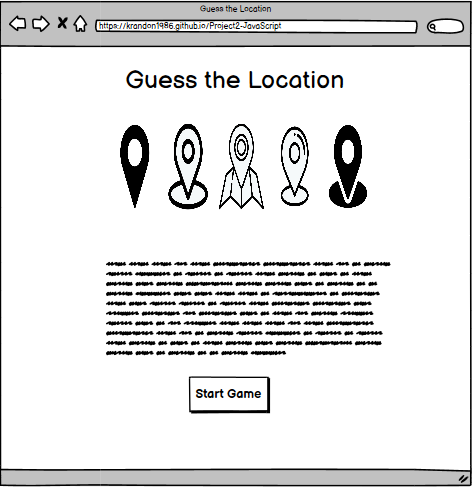 

    - The game page where you can start the game or return back to the menu.

    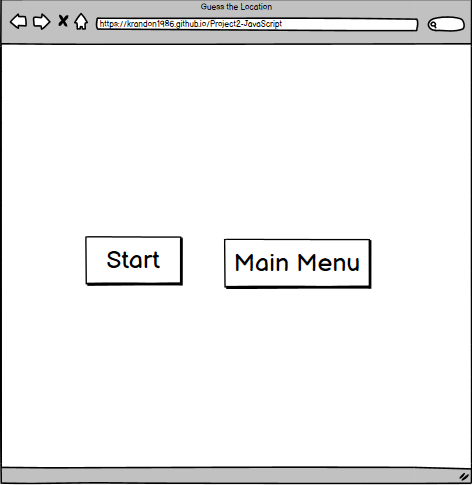

    - The same game pages where you currently playing the game.

    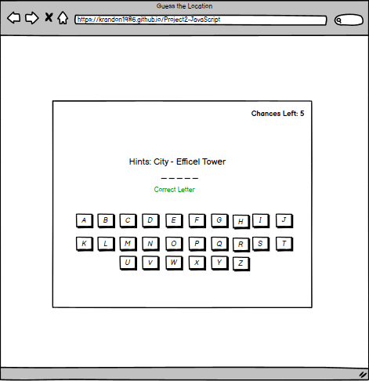

    - Feedback to the game when the player loses.

    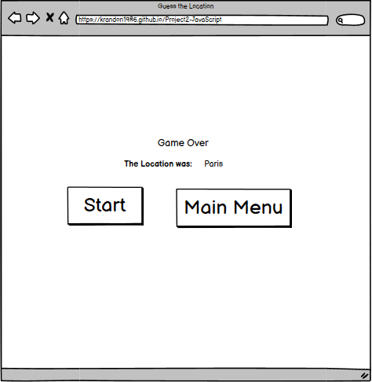 

    - Feedback to the game when the player wins.

    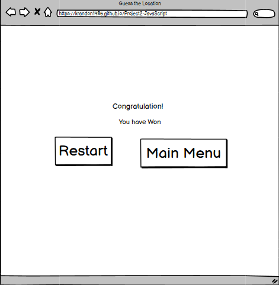

## Features
In this section, the features that have been implemented on the site will be explained.

- __Heading and Rules__ 
    - The title is displayed in Poppin font inbetween the two images of location logos. 
    - The rule of the game is displayed before the main heading, along with the play button that is lead to the main game page.
    - The play icon on the play button is from [Font Awesome](https://fontawesome.com/)

    

- __Game Buttons__
    - On the game page, there are two buttons.
        - The Main Menu button will lead the player back to the main menu page when it is clicked.
        - The Start button will allow the player to start the game. 
    
      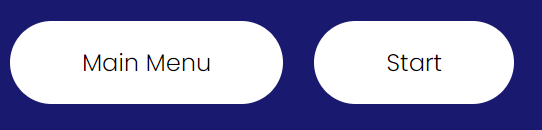

- __Game Area__
    - There is a life counter on the top right hand corner of the board to indicate the amount of wrong answers you can get before it is game over. 
    - The hint section will display a clue on what the location is. 
    - The game input will display the answer, but each letter will be replaced by _ unless the player select the right letter that matches the letter in the answer. 
    - The 26 buttons on the board are consist of the letter of the alphabet, in alphabetical order instead of keyboard letter order. 

    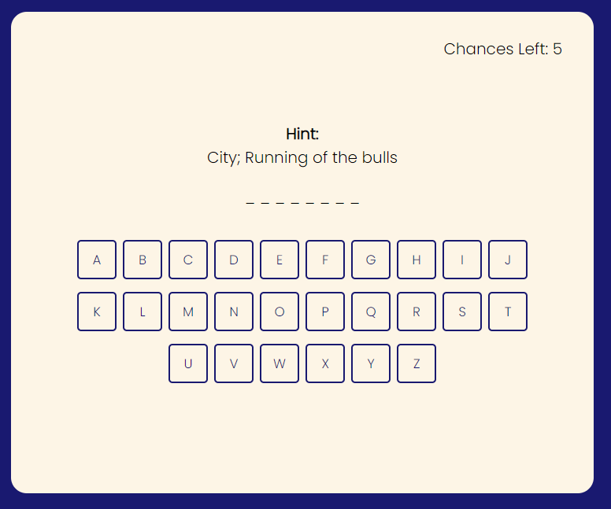  

    - When the player selects a letter that is in the game input field, the letter of the missing word will be revealed and the selected button highlighted green to indicate that it is the right letter. 

      

    - However, if the player selects the wrong letter, a life is taken and the selected button is highlighed red to indicate that it is wrong letter. 

      

- __Game Result__
    - When the player get all the right letters, the game ends with a victory.

    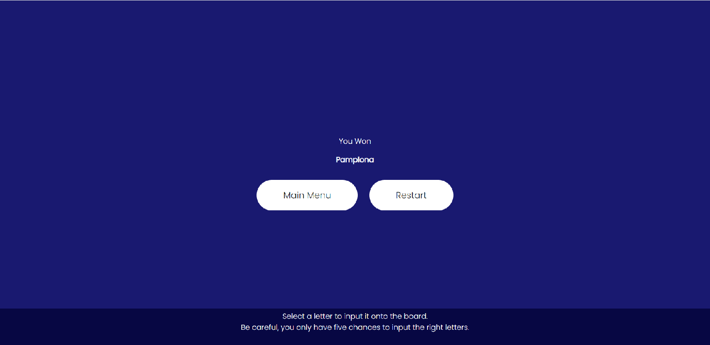

    - After running out of the five lives, the games end with a game over and also reveals the right answer to the player.

    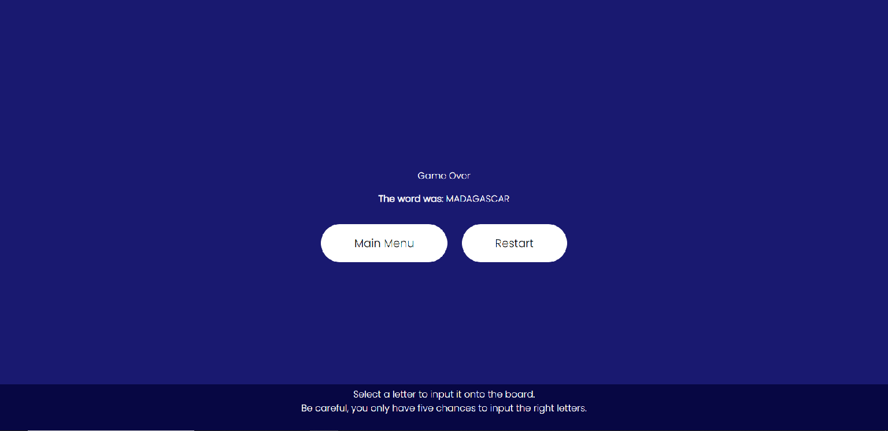

- __Win and Lose Count__
    - After winning a game, there will be a win count under the result to indicate the numbers of victories you have accumulated.
    - When you lose a game, there will be a loss count underneath the win count that shows the numbers of losses you have gain.
    - When you exit the game by returning the main menu, you win and lose count will reset to 0 when you start the game again. 

    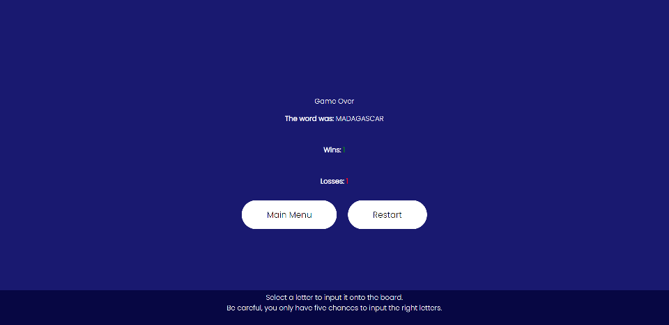 

## Testing 

- HTML Validator
    - No errors were shown after HTML code was passing through [W3C validator](https://validator.w3.org/nu/?showsource=yes&doc=https%3A%2F%2Fkrandon1986.github.io%2Fproject-2-js-guess-the-location%2F#l13c73)

- CSS Validator 
    - No errors was found when passing the CSS code through [(Jigsaw) validator](https://jigsaw.w3.org/css-validator/validator?uri=https%3A%2F%2Fkrandon1986.github.io%2Fproject-2-js-guess-the-location%2F&profile=css3svg&usermedium=all&warning=1&vextwarning=&lang=en)

- Accessibility 

    - Main Menu

        

    - Game Area

        

- Mobile Responsiveness
    - Maximum screen width for responsive design was done at 375px.   
    - Mobile responsiveness was limited to the "toggle device" feature in Chrome Developer Tools due to lack of access to more physical devices.

## Bugs

| Bug | Solution |
| --------------- | --------------- |
| 1. HTML Validator identifies there is a illegal character on the page | There was a space in image filename, so I removed it.|
| 2. The Heading is out of proportions on the mobile device | Scale down the max-width to max-width of the mobile devices.|
| 3. The Increment operators for the Win and Loss counts is not working probably as when I lose or win a game for a second time, the count remind as 1. | Having these lines of code: "victory: 0;" and "lose: 0;" in the initial game function has prevented the count from going beyond 1. So I removed these two lines of code and it win and lose counts works prefectly. 

## Deployment

This Guess the Location site was deployed on GitHub page.

- Here are following steps to deploy your site:
    - In your GitHib repository, click the 'setting' tab.
    - Look at the left menu and select 'Pages'
    - In the source section drop-down menu, select the 'Main Branch' and click 'Save'
    - After a successful save, the GitHub section will display a message to inform you that the site is ready to be published at https://krandon1986.github.io/project-2-js-guess-the-location/

## Credit
 - The framework I used to build the "Guess the Location" game is from a Youtube Javascript tutorial video created by [Coding Artist](https://youtu.be/-qd5sjOfgYY?si=P-blTVa5n_2cj4am)
 
 - General Guidance 
    - [Font](https://fonts.google.com/)
    - [Icons](https://fontawesome.com/)
    - [color](https://www.w3schools.com/)
