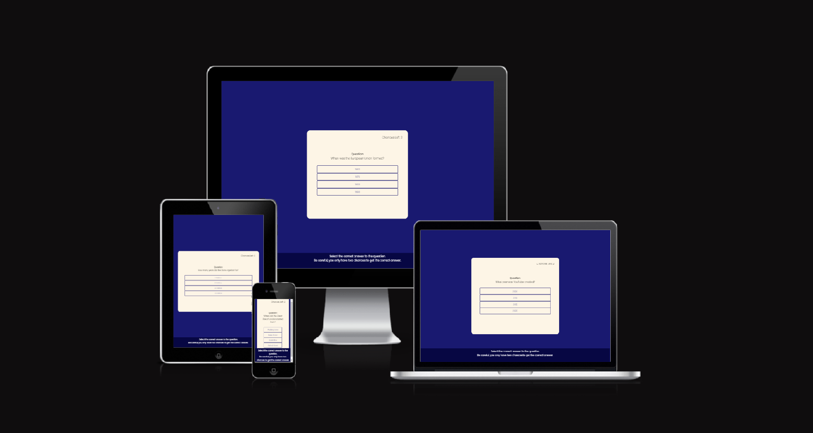
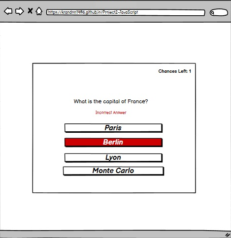
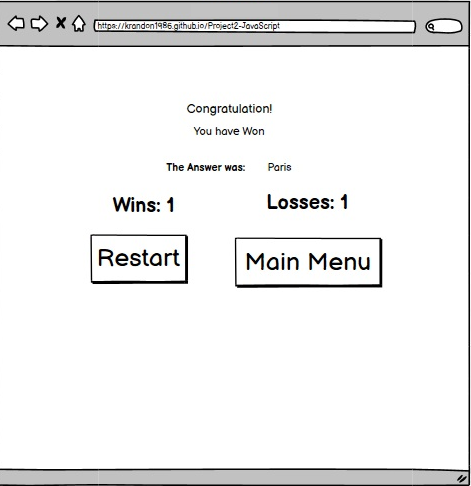
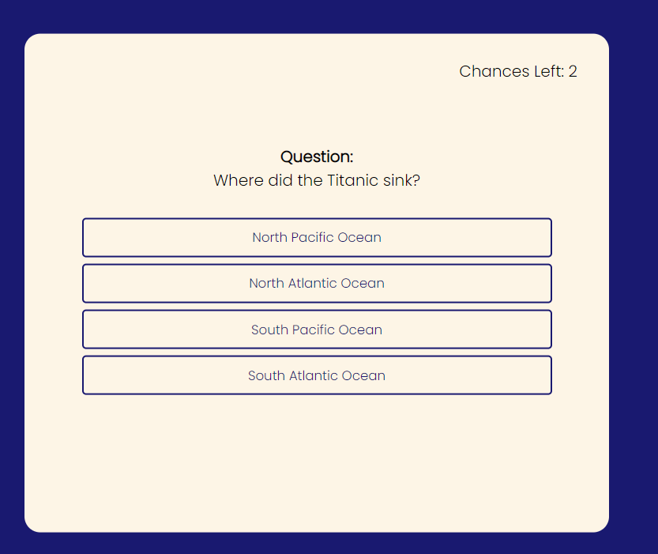
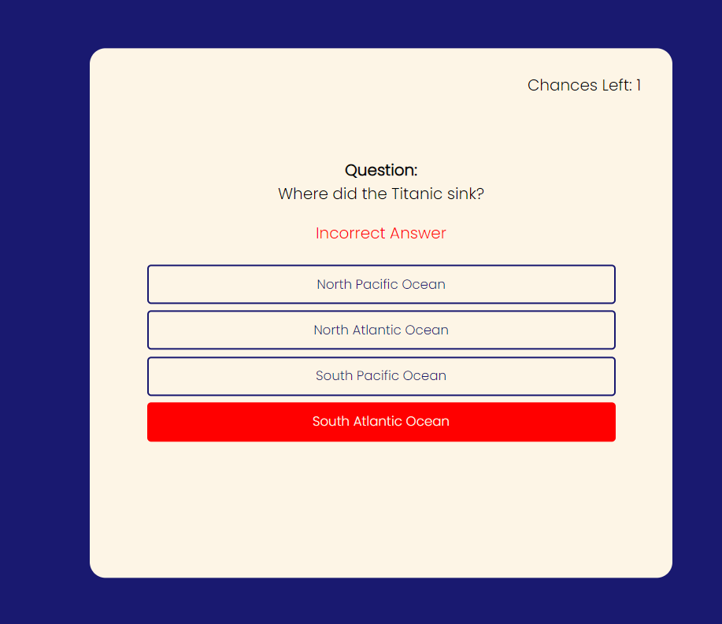
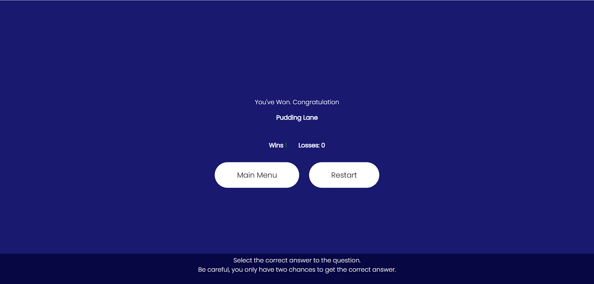
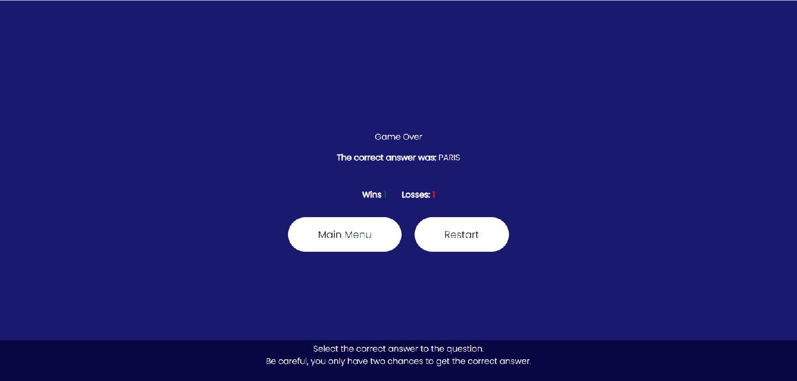
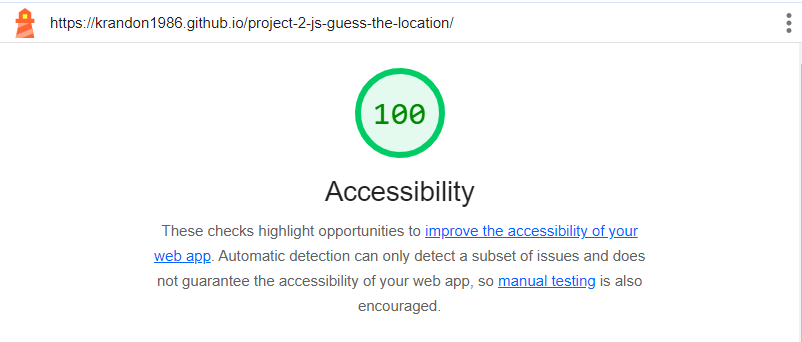

<h1 align="center">Quiz Time</h1>

## Description 

This game is a simple multiple choice quiz where you are presented with random questions and four possible answers with the correct one to choose from. 

Unlike most multiple choice quiz, you get two chances to get the right answer. Selecting the wrong answer will result in the user losing a life and the button being colored red. Once the user two lifes are up, the game is over and it will reveal the correct answer. 

The site is live can be access [here](https://krandon1986.github.io/project-2-js-guess-the-location)

## Design 

- __Color Pallete__ 
    - The two main colors that are used MidnightBlue and OldLace.
    - MidnightBlue is used as the background color for the site. 
    - OldLace is used as the background color for the game board and its letter buttons on it. 

- __Typography__
    - Poppins google font will be used for throughout the site, and it will fall back to san serif if the web browser can't render Poppin font on the site. 

- __Wireframe__
    - The Main menu of the game.

     

    - The game page where you can start the game or return back to the menu.

    

    - The same game pages where you currently playing the game.

    

    - Feedback to the game when the player loses.

     

    - Feedback to the game when the player wins.

    

## Features
In this section, the features that have been implemented on the site will be explained.

- __Heading and Rules__ 
    - The title is displayed in Poppin font inbetween the two images of location logos. 
    - The rule of the game is displayed before the main heading, along with the play button that is lead to the main game page.
    - The play icon on the play button is from [Font Awesome](https://fontawesome.com/)

    

- __Game Buttons__
    - On the game page, there are two buttons.
        - The Main Menu button will lead the player back to the main menu page when it is clicked.
        - The Start button will allow the player to start the game. 
    
      

- __Game Area__
    - There is a life counter on the top right hand corner of the board to indicate the amount of wrong answers you can get before it is game over. 
    - The question section will display the question that the user has to answer.  
    - The four buttons below the question section contain four possible answer. One of them is the correct answer, the other four are false. 

      

    - If the player selects the wrong answer, a life is taken and the selected button is highlighed red to indicate that it is wrong answer.
    - A message below the question section will appear saying 'Incorrect Answer' in red letters. 
    - The wrong answer button will be marked as disable, so that the player won't be able to click again and accidently lose the game. 

      

- __Game Result__
    - When the player get the right answer, the game ends with a victory.
    - There will be a win count underneath the result to indicate the number of victories you have accumulated.

    

    - After running out of the two lives, the games end with loss and the correct answer will displayed.
    - Like the win count, the loss count beside it will show the number of losses you have accumulated.
    - When you exit the game by returning the main menu, your win and lose count will reset to 0 when you start the game again. 

    

## Testing 

- HTML Validator
    - It has indicated that the font-weight attributes on the span element isn't allowed. 
    - The form element isn't allowed to be a child class for the span element.
    - After the corrections, there are no more errors were shown after HTML code was passed through W3C validator: 
        - [Main Menu](https://validator.w3.org/nu/?showsource=yes&doc=https%3A%2F%2Fkrandon1986.github.io%2Fproject-2-js-guess-the-location%2F#l13c73)
        - [Game](https://validator.w3.org/nu/?showsource=yes&doc=https%3A%2F%2Fkrandon1986.github.io%2Fproject-2-js-guess-the-location%2Fgame2.html%3F#l13c73)

- CSS Validator  
    - There are several incorrect operators in the start IDs and menu classes in the CSS.  
    - After the corrections, there were no errors was found when passing the CSS code through [(Jigsaw) validator](https://jigsaw.w3.org/css-validator/validator?uri=https%3A%2F%2Fkrandon1986.github.io%2Fproject-2-js-guess-the-location%2F&profile=css3svg&usermedium=all&warning=1&vextwarning=&lang=en)

- JavaScript Check
    - This javascript has no errors, but has 48 warnings on the several lines of code being available in the ES6 (ECMAScript6)
    - One variable in the script is not used, so I removed it from the code. 
    - Click [here](https://jshint.com/) to open the JSHint page, and copy and paste the code inside it check the code from your perspective. 

- Accessibility 

    - Main Menu

        

    - Game Area

        

- Mobile Responsiveness
    - Maximum screen width for responsive design was done at 375px.   
    - Mobile responsiveness was limited to the "toggle device" feature in Chrome Developer Tools due to lack of access to more physical devices.

## Bugs

| Bug | Solution |
| --------------- | --------------- |
| 1. HTML Validator identifies there is a illegal character on the page | There was a space in image filename, so I removed it.|
| 2. The Heading is out of proportions on the mobile device | Scale down the max-width of the mobile devices.|
| 3. The Increment operators for the Win and Loss counts is not working properly as when I lose or win a game for a second time, the count remind as 1. | Having these lines of code: "victory: 0;" and "lose: 0;" in the initial game function has prevented the count from going beyond 1. So I removed these two lines of code and it win and lose counts works prefectly.|
| 4. There is a console error in the main menu as the page can't read the addEventListener from the javascript | There is no javascript code running on the main menu, hence why they page can't detect the addEventListener. I removed the script source link from the main menu as it isn't needed in the main menu. |
| 5. The Spare live count is overlapping with itself. | I added an unneccessay construct to the script that display the live count as it is already generated in the question class div. 
| 6. The game doesn't end after the correct answer has been selected. | Make some adjustment to the code by changing the if statement in correctAnswerHandle function to end the game in a victory if the winCount is 1, as well as defining the winCount value to 1.  

## Deployment

This Guess the Location site was deployed on GitHub page.

- Here are steps I followed to deploy my site:
    - In your GitHib repository, click the 'setting' tab.
    - Look at the left menu and select 'Pages'
    - In the source section drop-down menu, select the 'Main Branch' and click 'Save'
    - After a successful save, the GitHub section will display a message to inform you that the site is ready to be published at https://krandon1986.github.io/project-2-js-guess-the-location/

## Credit
 - The framework I used to build the "Quiz Time" game is from a Youtube Javascript tutorial video created by [Coding Artist](https://youtu.be/-qd5sjOfgYY?si=P-blTVa5n_2cj4am)
 
 - General Guidance 
    - [Font](https://fonts.google.com/)
    - [Icons](https://fontawesome.com/)
    - [color](https://www.w3schools.com/)
